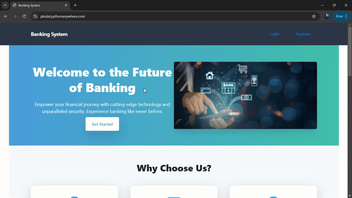

<div align="center">
  <h1 align="center">Banking Application</h1>  
      
</div>


# Overview
A Django-based banking application that allows users to register and manage their banking details securely. This project showcases a robust and responsive user interface along with backend functionalities that handle transactions and user data effectively.

## 🌟 Features

- **User Registration**: Secure user registration with form validation.
- **Responsive Design**: Mobile-first approach with a clean and modern interface.
- **Transaction Management**: Manage and track transactions.
- **Error Handling**: Proper error display for user inputs.
- **Secure Data Storage**: Secure storage and management of user data.
- **Responsive Forms**: Responsive and intuitive forms for better user experience.

## 🚀 Live Demo


  [`Banking Application`](https://pkulal.pythonanywhere.com/)

## 🚀 Getting Started

### Prerequisites

Ensure you have the following installed:

- Python 3.8+
- Django 4.0+
- Git

### Installation

1. **Clone the repository:**

   ```bash
   git clone https://github.com/PKulal/Banking-Application.git
   cd Banking-Application

2. **Create and activate a virtual environment::**

   ```bash
   python -m venv venv
   source venv/bin/activate  # On Windows use `venv\Scripts\activate`

3. **Install dependencies:**

   ```bash
   pip install -r requirements.txt

4. **Apply migrations:**

   ```bash
   python manage.py migrate

5. **Clone the repository:**

   ```bash
   git clone https://github.com/PKulal/Banking-Application.git
   cd Banking-Application
6. **Create a superuser:**

   ```bash
   python manage.py createsuperuser

7. **Access the application:**

   ```bash
   Open your browser and go to http://127.0.0.1:8000/

## 🧩 Usage
- **Register a New User**: Sign up with your details.
- **Login**: Access your account using your credentials.
- **Manage Transactions**: View and manage your transactions

## 🛠️ Technologies Used
- **Django**: High-level Python web framework.
- **Tailwind CSS**: For responsive and modern design.
- **JavaScript**: Client-side scripting.
- **HTML5 & CSS3**: Structure and style the pages.

## 🤝 Contributing
Contributions are welcome! Please follow these steps:
- **Register a New User**: Sign up with your details.
- **Login**: Access your account using your credentials.
- **Manage Transactions**: View and manage your transactions

## 🧩 Usage
- 1.Fork the project.
- 2.Create a new branch for your feature or bugfix.
- 3.Make your changes and commit them with descriptive messages.
- 4.Push your changes to your forked repository.
- 5.Create a Pull Request against the main branch.

